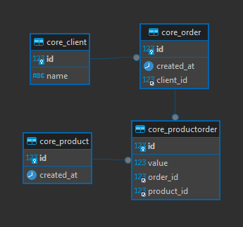
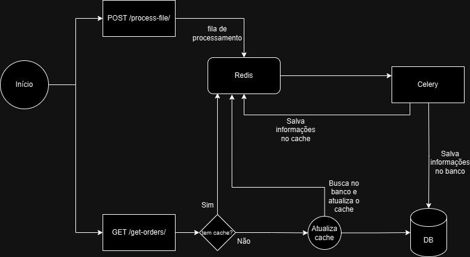

# Desafio Logística

Esse projeto consiste em uma API Rest para processar e normalizar dados recebidos a partir de um Endpoint, e disponibiliza-los via Rest também.


## Tecnologias utilizadas

- Python
   - O Python foi escolhido como linguagem principal devido à sua facilidade de uso e normalização de dados mas também a sua sintaxe clara.
- Django
    - A escolha do Django foi pela gama de facilidades para realizar o que se pede no desafio, o Django por si só já tem várias funcionalidades prontas, como o Django ORM, Django test, e aliado ao Django REST framework, conseguimos construir API'S de forma fácil e rápida.
- Celery
    - A escolha do Celery foi pela praticidade em trabalhar com funções assincronas, que foi o caso do processamento de arquivo que é enviado em um endpoint específico, possibilitando uma resposta rápida na requisição e processando o arquivo em segundo plano.
- Redis
    - O redis foi escolhido para auxiliar o celery em suas funções assincronas e salvar dados cacheados para uma consulta de dados mais performática.
- MySQL
    - Para o desafio o MySQL foi escolhido por ser um database mais leve e mais rápido em leitura simples, porém em um projeto real, o PostgreSQL seria também uma ótima escolha.

---

## Instalação

Utilizando docker e docker-compose:

Caso não tenha o docker-compose instalado, siga o tutorial oficial para a instalação: https://docs.docker.com/compose/install/

Execute o comando:

```sh
docker-compose build
```

```sh
docker-compose up
```

Você já terá o projeto sendo executado e com os testes que foram feitos também executados.

### Para instalação manual:

Crie um ambiente virtual

```
python3 -m venv venv
```

Ative o ambiente virtual

```
source venv/bin/activate #linux
venv\Scripts\activate #windows
```

Instale as dependencias

```
pip install -r requirements.txt
```

Configure o redis na sua máquina:

```
#linux
sudo apt update
sudo apt install redis-server
```

Para windows:
```
Baixe ou instale a versão desejada
https://github.com/microsoftarchive/redis/releases
```

Inicie o redis:
```
redis-server
```

Após isso, com o ambiente virtual ativado, rode as migrations do banco de dados:

```
python manage.py migrate
```

Execute o projeto:
```
python manage.py runserver
```

Execute o celery para chamadas assincronas:
```
celery -A desafio_logistica worker --loglevel=info
```

Para executar os testes:
```
python manage.py test
```
---

# Utilizando o projeto


Estrutura do projeto
```
- desafio-logistica/
  - desafio_logistica/ # app principal
    - celery.py # configurações do celery
    - settings.py # configurações do projeto
    - urls.py # definição de rotas
  - core/ # app com as regras de negócio
    - views.py # onde fica o processamento das requisições
    - models.py # gerenciamento do banco de dados
    - tasks.py # função assincrona dos arquivos
    - tests.py # todos os testes
    - utils.py # funções que podem ser reaproveitadas
    - pagination.py # configuração de paginação
  - manage.py # arquivo principal

```

<b>Na pasta documentação tem o arquivo da collection do Postman, você pode usar essa collection para realizar os testes nos endpoints.</b>

Para processar os arquivos, temos a rota:


<b>POST /file-processor/ </b> - É uma rota onde a resposta da requisição é imediata, e o processamento do arquivo em si, fica em segundo plano, se passado pelas validações.

É uma rota que aceita o envio apenas de um arquivo, e arquivos txt.


Para a consulta dos dados normalizados temos a rota

<b>GET /get-orders/</b> - É uma rota onde pode retornar todos os dados do banco, ou filtrados de acordo com o que é passado na URL.

Exemplos:

```/get-orders/ > trás todas as orders```

```/get-orders/?order_id=1 > trás a order específica```

```/get-orders/?start_date=2021-01-01 > trás as orders maior ou igual a data passada```

```/get-orders/?end_date=2021-02-01 > trás as orders menor ou igual a data passada```

todos os paramêtros da URL podem ser combinados.

A ideia é que essa rota seja performática, e para isso utilizamos o redis como cachamento das informações para que o retorno da requisição seja rápido.


### Modelagem do banco de dados


### Fluxograma API


### Pontos de melhoria:
Pensando em um projeto real, poderiamos melhorar algumas questões que foram feitas no desafio.

- Substituição de print por logs
- Notificar o projeto responsável pela request pelos erros de processamento dos arquivos (algum webhook ou algo nesse sentido)
- Autenticação nas rotas
